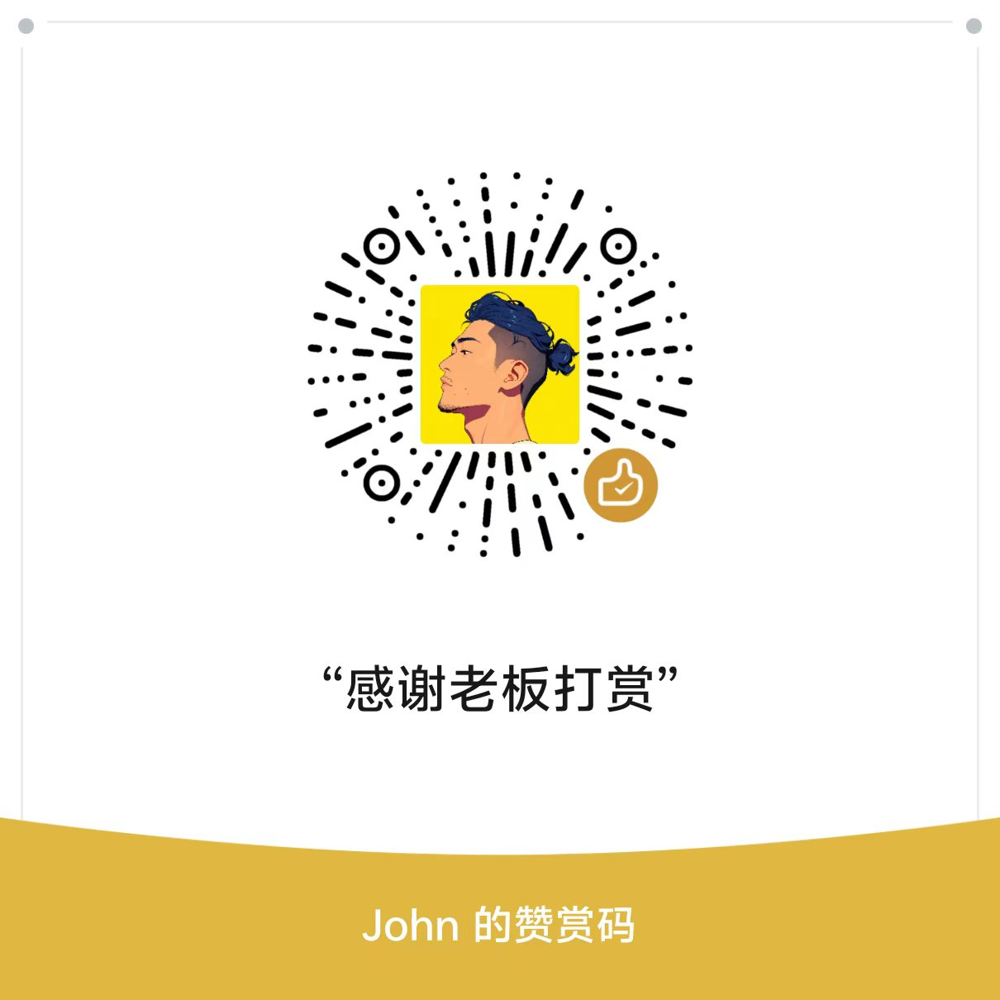

# VEIL

**基于 sing-box 内核的 Android 代理客户端**：支持规则 / 全局 / TUN 三种代理模式，可导入自备订阅与分享链接，在手机端完成节点管理、测速与连接。

- 包名：`com.aurelia.app`
- 当前版本：0.4.3（versionCode 58）
- 运行平台：Android 8.0 及以上（minSdk 26）

> 本项目只发布 APK 安装包，不公开源码，也不提供构建工程。

---

## 核心功能

### 1. 代理内核与协议支持

内置 sing-box 内核（`libbox`），支持以下出站协议：

| 协议 | 说明 |
| --- | --- |
| VLESS | 支持 TLS / WebSocket 等传输配置 |
| VMess | 支持 WebSocket 等传输配置 |
| Trojan | 标准 Trojan 出站 |
| Shadowsocks | 支持 `obfs-local`（simple-obfs / obfs）、`v2ray-plugin` 插件 |
| Hysteria2 | 标准 Hysteria2 出站 |

- Shadowsocks 加密方式按内核支持集校验：不受支持的加密方式（如部分旧式加密）会被标注，且**不会写入内核配置**，避免单个节点导致整份配置加载失败、连带其它节点不可用。
- `v2ray-plugin` 的 mux 参数显式透传（未给出时按 0 处理），与 Clash / Mihomo 及 Cloudflare Worker 类服务端的默认行为保持一致。

### 2. 订阅与节点导入

支持四类订阅内容，自动识别格式：

| 格式 | 支持情况 |
| --- | --- |
| 明文分享链接 | 单条或整段多行列表 |
| Base64 包裹的订阅内容 | 解码后按链接列表或配置型订阅二次识别 |
| Clash / Mihomo（YAML）配置型订阅 | 抽取节点并保留原始出站配置精度（ws headers、grpc、plugin-opts 等） |
| sing-box（JSON）配置型订阅 | 同上 |

- 解析失败时返回可读原因，不静默留空；因类型不支持而被跳过的条目会给出提示。
- 订阅名称多级自动识别：URL 片段备注名、响应头 `profile-title`、`content-disposition` 文件名、配置内容中的 `name` 字段，均取不到时回落为「订阅 N」。
- 订阅支持新增、更新（单条重新拉取）与删除；也可直接导入单条分享链接。
- 支持扫描二维码导入订阅或节点，取景与解码均在本地完成（CameraX + zxing），不依赖任何在线识别服务。

### 3. 代理模式

| 模式 | 行为 |
| --- | --- |
| 规则 | 大陆域名（geosite-cn）与大陆 IP（geoip-cn）直连，其余流量走代理 |
| 全局 | 除局域网地址外全部流量走代理；非 TUN 模式下拒绝 QUIC（UDP 443），促使应用回落 TCP |
| TUN | 在全局基础上放行 UDP / QUIC，实现全协议接管 |

- 三种模式在设置面板中切换，写入本地设置后即时生效；内核运行中切换由内核热重载，无需重新连接。

### 4. DNS 分流

- 国内域名：走加密 DNS（DoT 直连 `223.5.5.5`），保证拿到就近的国内 CDN 节点。
- 境外域名：走代理侧加密 DNS（DoT `8.8.8.8`，经代理出站），规避本地 DNS 污染。
- 节点自身域名：固定使用直连 DNS 解析，避免「解析节点域名需先连上节点」的解析死循环。
- 应用 DNS 查询由内核接管（hijack-dns），按上述同一套判定分流；解析策略固定为 IPv4，避免无 IPv6 网络下直连连接失败。

### 5. 广告拦截（默认关闭）

- 开启后在内核路由层插入 reject 规则，命中的广告 / 追踪域名直接拒绝，不产生任何出站流量。
- 规则来源优先使用内置的 `geosite-ads.srs`（官方 geosite `category-ads-all` 二进制规则集，覆盖数万条广告与追踪域名）；资源缺失或解包失败时，自动降级为内置的域名后缀与广告 SDK 特征词清单。
- 规则位置固定在「劫持 DNS」之后、所有直连 / 代理业务规则之前，因此在规则 / 全局 / TUN 三种模式下均生效，也不影响代理模式本身的判定。
- 状态持久化，重启保留；连接中切换由内核热重载即时生效。

### 6. 内置分流规则集

- 内置 `geosite-cn.srs`（大陆域名）与 `geoip-cn.srs`（大陆 IP 段），首次启动解包到应用私有目录，后续启动直接复用。
- 解包任一步骤失败时自动降级为内置的大陆域名后缀清单，连接与分流功能不受影响。

### 7. 节点管理与测速

- 节点卡片提供一键测速；每个节点行支持单独测速，测速进行中显示加载状态。
- 测速完成后隐藏不可达节点，并按延迟升序重排；未测速、取消测速、切换或重新拉取订阅时恢复完整列表与原有顺序。
- 不可达节点与内核不支持的节点均有明确标注。
- 默认节点按可用性优先级自动选取：可连接（按延迟升序）→ 未测速 → 不可达 → 内核不支持。

### 8. 流量统计

- 实时展示本次连接的上行 / 下行流量，数据来自内核状态流。
- 额外展示持久化累计流量：自首次使用起累加，断开连接不清零，冷启动继续累计，清除应用数据后归零。

### 9. 界面与交互

- 单页主界面：圆环连接开关 + 节点切换卡片 + 流量卡 + 底部「+」（导入订阅 / 链接）与「设置」入口。
- 启动时仅恢复本地节点与订阅，不自动连接；连接只由用户点击圆环触发，首次连接需授予 VPN 授权。
- 主题支持「跟随系统 / 浅色 / 深色」，选择后立即生效并持久化。
- 支持自定义主页背景：从相册选图后进入裁剪页（拖动 + 缩放），确认后立即生效，可随时移除。
- 交互含轻量触感反馈；设置面板内置更新日志页（版本倒序 + 构建日期 + 改动条目）。
- 屏幕适配：内容列最大宽度限制为 480dp 并居中（大屏 / 折叠屏不全宽拉伸）；320dp 级窄屏收敛左右留白；矮屏下主体可滚动、底部按钮固定可见。

---

## 界面与技术栈

### 技术栈

| 项目 | 说明 |
| --- | --- |
| 开发语言 | Kotlin |
| 界面框架 | Jetpack Compose（Compose BOM 2024.09.03）+ Material 3 |
| 代理内核 | sing-box（`libbox.aar`，1.14 系列），配置按 1.14 规范生成 |
| 网络请求 | OkHttp 4.12.0（订阅拉取） |
| 二维码扫描 | CameraX 1.3.4 + zxing 3.5.3（本地解码） |
| 异步 | Kotlin Coroutines 1.9.0 |
| 数据存储 | SharedPreferences 本地持久化（节点、订阅、设置、累计流量） |
| 构建 | compileSdk 34 / targetSdk 34 / minSdk 26，Java 17，Release 开启 R8 混淆与资源压缩 |
| Release ABI | arm64-v8a |

### 权限说明

| 权限 | 用途 |
| --- | --- |
| INTERNET | 拉取订阅、建立代理连接 |
| ACCESS_NETWORK_STATE / ACCESS_WIFI_STATE | 网络状态判断 |
| FOREGROUND_SERVICE / FOREGROUND_SERVICE_SPECIAL_USE | 代理内核前台服务常驻 |
| POST_NOTIFICATIONS | 显示内核运行状态通知 |
| BIND_VPN_SERVICE（服务声明） | 建立系统 VPN 隧道，由系统在连接时征得用户授权 |
| CAMERA（可选，硬件非必需） | 扫描二维码导入订阅或节点，可拒绝授权，不影响其它功能 |

---

## 版本信息

| 项目 | 内容 |
| --- | --- |
| 应用名称 | VEIL（应用标签为 Veil） |
| 包名 | com.aurelia.app |
| 当前版本 | 0.4.3 |
| versionCode | 58 |
| 构建日期 | 2026-09-24 |
| minSdk / targetSdk | 26（Android 8.0）/ 34（Android 14） |
| 安装包 | app-release.apk，83,826,825 字节（约 79.9 MB），arm64-v8a |

本版本的具体改动见 [v0.4.3 Release 说明](https://github.com/jasbak1022/VEIL/releases/tag/v0.4.3)；应用内「设置 - 更新日志」亦可查看历史版本记录。

---

## 安装方式

**本项目仅提供 APK 安装包，不提供源码、不提供构建工程，也不接受源码相关的构建咨询。**

1. 在 Releases 页面下载最新安装包 `app-release.apk`。
2. 在系统设置中允许「安装未知来源应用」（或允许当前浏览器 / 文件管理器安装应用）。
3. 点击 APK 完成安装。安装包仅包含 arm64-v8a 架构，仅适用于 64 位 ARM 设备，最低要求 Android 8.0。
4. 首次连接时系统会弹出 VPN 授权请求，需确认后才会建立隧道；如需扫码导入，可另行授予相机权限（可选）。
5. 导入自备的订阅或分享链接后，选择节点并点击圆环开关即可连接。

### 使用须知

- 应用**不含任何内置节点、订阅或服务器**，需自备可用的节点或订阅。
- 连接异常的排查顺序建议为：确认节点自身可用（先测速）→ 确认订阅内容可正常解析 → 切换代理模式（规则 / 全局 / TUN）复测。
- 应用内「设置 - 更新日志」可确认当前版本与改动记录。

---

## 赞赏支持

VEIL 完全免费，无广告、无内置节点，开发与维护均由个人在业余时间完成。如果它对你有帮助，欢迎扫码赞赏支持（WX赞赏码）：

  

赞赏完全出于自愿，不影响任何功能的可用性；收到支持会优先用于后续版本的维护与优化。

---

## 免责声明

1. 本应用仅供个人学习与技术研究使用，请勿用于任何违反当地法律法规的用途。
2. 使用者应自行确保其网络行为符合所在国家或地区的法律法规；因使用本应用产生的任何后果由使用者自行承担。
3. 本应用不提供、不托管、不销售任何节点或代理服务，所有连接目标均由使用者自行配置。
4. 本项目以「现状」提供，不对可用性、稳定性或特定用途适用性作出任何明示或暗示的担保。
5. 使用本应用即表示已阅读并同意上述声明。

反馈渠道：Telegram 频道 `t.me/Jasbak2026`，Telegram 群组 `t.me/+Ge180qJxcTUwNDU1`。
